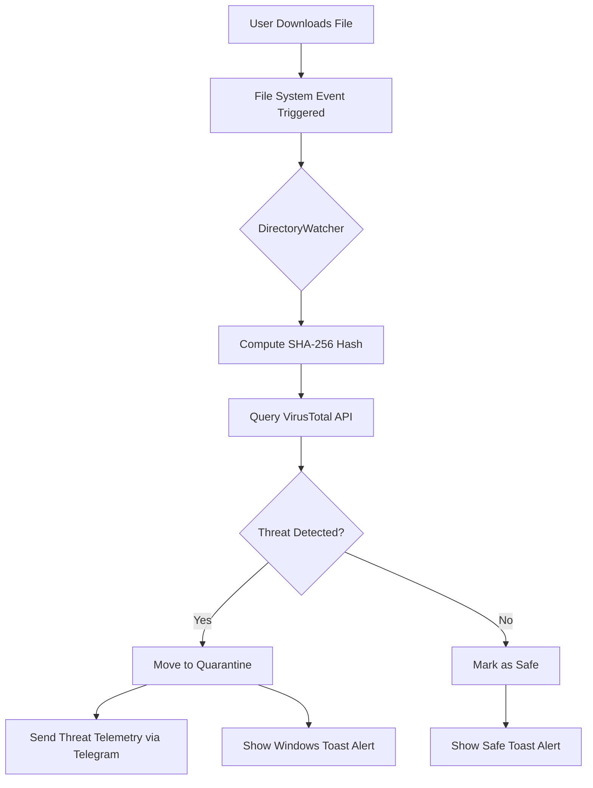

# Sentinel-VT: Real-time Zero Trust File Scanner

[]()
[]()
[]()

**Sentinel-VT** is an advanced, real-time cybersecurity tool designed to bridge the gap in "blind download" monitoring. It instantly intercepts files downloaded to the system, validates them via the VirusTotal API using SHA-256 hashing, and automatically quarantines malicious threats before they can be executed.

## 🛡️ Blue Team & SecOps Benefits

*   **Zero-Trust Architecture:** Assumes every downloaded file is potentially malicious until verified.
*   **Real-time Interception:** Detects new files within seconds using `watchdog` system event listeners.
*   **AI-Augmented Validation:** Leverages the global intelligence of VirusTotal for multi-engine malware analysis.
*   **Automated Incident Response (Quarantine):** Instantly moves detected threats to a locked `Quarantine` directory.
*   **Cross-Channel Telemetry:** Delivers alerts via Windows Desktop Toasts and secure Telegram Bot integrations.

## ⚙️ How It Works



## 🚀 Installation & Setup

1.  **Clone the Repository & Install Dependencies:**
    ```bash
    git clone https://github.com/berkaymhc/virus-detect.git
    cd virus-detect
    pip install -r requirements.txt
    ```

2.  **Configuration (.env):**
    Security is a priority. Sentinel-VT relies strictly on environment variables for sensitive tokens. Create a `.env` file in the root directory:
    ```env
    VT_API_KEY=your_virustotal_api_key_here
    TELEGRAM_BOT_TOKEN=your_telegram_bot_token_here
    TELEGRAM_CHAT_ID=your_telegram_chat_id_here
    ```
    *Note: If the application is launched without a `VT_API_KEY`, a secure Setup Wizard will guide you through acquiring and saving one.*

3.  **Run Sentinel-VT:**
    ```bash
    python src/sentinel.py
    ```

## 🛠️ Architecture

The codebase follows strict Object-Oriented Programming (OOP) standards:
*   `ConfigManager`: Securely loads `.env` and manages application paths.
*   `LoggerService`: Provides comprehensive logging for audits and debugging, avoiding silent failures.
*   `NotificationService`: Handles cross-platform alert orchestration.
*   `YaraScanner`: Executes offline signature-based threat detection.
*   `VirusTotalScanner`: Encapsulates hashing, API communication, and response parsing.
*   `DirectoryWatcher`: Threaded implementation of `watchdog` to monitor the `Downloads` directory safely without race conditions.

---
*Built for the global cybersecurity community. Enhance your endpoint protection with Sentinel-VT.*